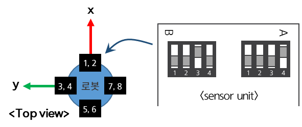

### 4.2.1	Sensor unit – Control unit communication
The sensor units and the control unit communicate using a CAN-FD bus. Communication between the sensor units and the control unit is diagnosed to ensure compliance with SIL 2 and PL d levels. Multiple sensor units connected to a single control unit must have unique IDs. The control unit and each sensor unit communicate using their respective unique IDs. By default, sensor units are assigned IDs based on their installation locations. Of the two IDs assigned to each sensor unit, odd IDs are allocated to Part A, and even IDs are allocated to Part B. The IDs for the built-in sensor units are assigned as shown below. For the setting method when the IDs are 1 and 2, refer to the figure below.

     </img>

