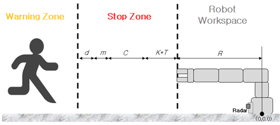

# Object Detection System

## 5.2 Detection Area

### 5.2.1 Meaning of Detection Area
The detection area is an arbitrarily designated zone within the measurable range of the sensor, with up to five detection areas possible. Detection areas are divided into warning zones and stop zones. Even if an object is detected within the measurable range of the sensor, if it does not fall within a detection area, the information is ignored.

### 5.2.2 Detection Area Parameters
The parameters for defining a detection area are as follows:
- Start/End distance of detection
- Start distance of warning zone
- Start/End angle of detection

### 5.2.3 Detection Area Distance
The distance range of the detection area is 100 mm to 5000 mm. The detection start distance must be set so that the robot’s movements are not measured. If the detection start distance is set smaller than the robot’s operating area, there is a risk of false detection of the robot’s movements. The detection start distance must be smaller than the detection end distance, and there must be a difference of at least 50 mm between them.

### 5.2.4 Start Distance of Warning Zone
The start distance of the warning zone is used as the reference point separating the warning zone and the stop zone. If an object is detected between the detection start distance and the warning zone start distance, the system outputs a stop signal to the robot. If an object is detected between the warning zone start distance and the detection end distance, the system outputs a signal to reduce the robot’s speed.

### 5.2.5 Detection Area Angle
The angular range of the detection area is between -55° and 55°. If the angle is set smaller than the specified minimum, the system may fail to detect objects or produce incorrect detections. The difference between the start angle and end angle must be at least 15°.

### 5.2.6 Stop Zone Calculation
The stop zone of the system corresponds to the danger zone of machinery and must be calculated according to the relevant standards. By default, the stop zone follows ISO 13855:2010. The stop zone distance configurable by the user cannot be smaller than the distance calculated according to the standard. The formula for calculating the danger zone of machinery specified in the standard is as follows:

* S = K × T + C  
* S: Stop zone  
* K: Maximum approach speed to the stop zone  
* T: Time required to stop the system  
* C: Correction factor  

The stop zone of the system described in this document has the same meaning as the danger zone of machinery standards. Since this system operates attached to the robot, the robot’s size must also be considered when calculating the stop zone. The formula can be modified as follows to include robot size:

* S = K × T + C + R + m + d  
* R: Distance of robot working area  
* m: Tolerance when detecting objects  
* d: User-defined distance  

The stop zone must be larger than the robot’s working area and cannot exceed the maximum distance of the system. Therefore, the range of the stop zone is as follows:  
* R ≤ Z_stop ≤ S  
