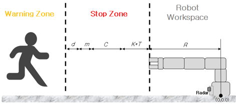

# Object Detection System

## 5.2	감지 영역

### 5.2.1	감지 영역 의미

 감지 영역은 센서가 측정 가능한 범위 내 임의로 지정된 영역으로, 최대 5개의 감지 영역을 가질 수 있다. 감지 영역은 경고 영역과 정지 영역으로 구분된다. 센서가 측정할 수 있는 범위에서 감지된 객체라도 감지 영역 안에 존재하지 않을 경우 정보를 무시한다.

### 5.2.2	감지 영역 매개변수

 감지 영역을 지정하기 위한 매개변수는 다음과 같다.
-	감지 시작/종료 거리
-	경고 영역 시작 거리
-	감지 시작/종료 각도

### 5.2.3	감지 영역 거리

 감지 영역의 거리 범위는 100mm-5000mm이다. 감지 시작 거리는 로봇의 움직임이 측정되지 않도록 설정해야 한다. 로봇이 움직이는 영역보다 감지 시작 거리를 작게 설정한 경우 로봇의 움직임을 오탐지할 가능성이 있다. 감지 시작 거리는 감지 종료 거리보다 작은 값으로 설정해야 하며, 감지 시작 거리와 감지 종료 거리는 50mm 이상 차이가 있어야 한다.

### 5.2.4	경고 영역 시작 거리

경고 영역 시작 거리는 경고 영역과 정지 영역을 구분하는 기준점으로 사용된다. 감지 영역 시작 거리부터 경고 영역 시작 거리까지의 영역에서 객체가 감지되는 경우 시스템은 로봇의 정지 유도 신호를 출력한다. 경고 영역 시작 거리부터 감지 영역 종료 거리까지의 영역에서 객체가 감지되는 경우 시스템은 로봇의 속도를 낮추는 유도 신호를 출력한다.

### 5.2.5	감지 영역 각도

 감지 영역의 각도 범위는 -55°에서 55°사이 이다. 감지 영역의 각도를 명시된 최소 각도보다 작은 값으로 설정할 경우 객체를 탐지하지 못하거나 잘못 탐지할 수 있다. 감지 시작 각도와 감지 종료 각도는 15° 이상 차이가 있어야 한다.

### 5.2.6	정지 영역 계산

시스템의 정지 영역은 기계류의 위험 영역에 해당하므로 해당 요구사항이 명시되어 있는 표준에 따라 계산되어야 한다. 기본적으로 시스템의 정지 영역은 ISO 13855:2010을 따른다. 사용자가 설정할 수 있는 정지 영역의 거리는 해당 표준에 따라 계산된 거리 보다 작을 수 없다. 표준에 제시되어 있는 기계류의 위험 영역을 계산하는 수식은 아래와 같다.

* S=K×T+C
* S: 정지 영역
* K: 정지 영역에 접근할 수 있는 최대 속도
* T: 시스템을 정지할 때까지 걸리는 시간
* C: 보정 값

본 문서에서 설명하는 시스템의 정지 영역은 기계류 표준의 위험 영역과 동일한 의미를 가진다. 이 시스템은 로봇에 부착되어 작동하므로 시스템의 정지 영역을 계산할 때 로봇의 크기도 함께 고려해야 한다. 로봇의 크기를 고려하여 정지 영역을 계산하는 수식을 아래와 같이 수정할 수 있다.

* S=K×T+C+R+m+d
* R: 로봇 작업 영역의 거리
* m: 객체 감지 시 공차
* d: 사용자 지정 거리

정지 영역은 로봇의 작업 영역보다 넓어야 하고 시스템이 가질 수 있는 최대 거리보다 길어질 수 없다. 따라서 정지 영역의 범위는 아래와 같다.
* R≤Z_stop≤S