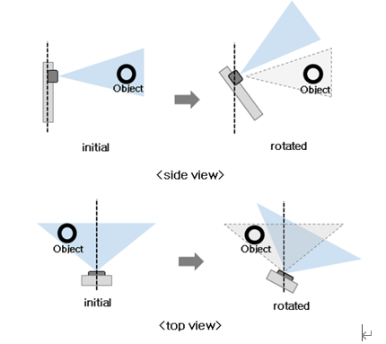
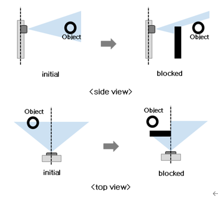

# Object Detection System

## 7.1 Overview of Additional Functions

The system performs the following additional functions:

### 7.1.1 Prevention of Axis Rotation
The system stores the axis state during sensor installation. If axis rotation occurs, the system issues a warning.  

When the sensor is installed outside the robot, the axis position information of the sensor is continuously transmitted from the sensor to the control board. The control board monitors the angular information of the axis in real time to determine if axis rotation has occurred. If axis rotation is detected, the system issues a warning.  

  
The axis rotation prevention function can be turned on/off for each sensor individually. When using an externally mounted radar, it must be set to On.  

  
The axis rotation prevention function must only be used in a fixed state.  

### 7.1.2 Detection of Sensor Front Obstruction
If an obstruction caused by a static object in front of the sensor persists for a certain period of time during sensor scanning, the system issues a warning.  

When the sensor detects environmental changes that can obstruct its field of view, it sends a signal to the controller. Regardless of the configured observation angle range, the sensor monitors an angle range of −50° to 50° on the horizontal plane.  

Detection of obstruction in front of the sensor is performed by the sensor itself, and the detection results are transmitted to the sensor control board. If obstruction persists for a certain period of time, the system issues a warning.  

  
If the robot is stopped due to sensor front obstruction detection, it remains in the stopped state.  

  
If the robot has stopped due to sensor front obstruction, the front obstacle must be removed, then a reset signal should be sent to the control board to restart the system.  
