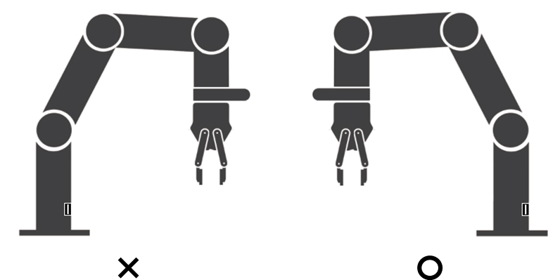
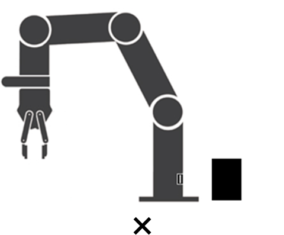
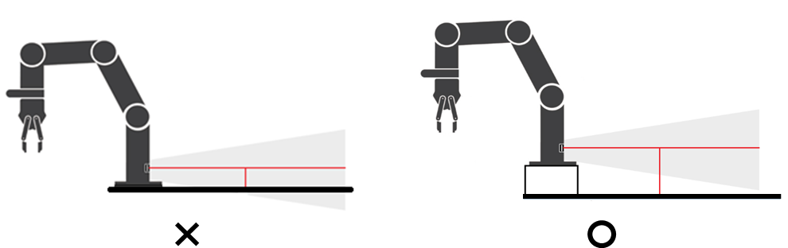

## 7.2	올바른 내장형 레이더 센서 사용
로봇 베이스에 장착된 내장형 센서 사용 시, 로봇이 센서 전면을 가리거나 통과하는 경우 오감지 또는 미탐지가 발생할 수 있으므로 주의가 필요하다. 내장형 레이더 센서만 사용시 로봇 베이스에 종단 저항이 연결되어 있어야 한다. 자세한 내용은 7.4.1설치 방법을 참고한다.

     </img>

감지 영역 내에 객체 감지를 방해할 수 있는 장애물, 펜스 등이 없어야 한다. 센서 전방에 설치된 장애물, 펜스 등을 통해 오탐지 또는 미탐지의 가능성이 있으므로 주의가 필요하다. 

     </img>

로봇이 설치된 바닥의 재질에 따라 센서의 오탐지 또는 미탐지가 발생할 수 있다. 바닥에 의한 감지 오류가 우려되는 환경에서는 로봇을 바닥에서 일정 거리 이상 띄워서 설치함으로써, 센서가 바닥을 감지하지 않도록 주의해야 한다.

     </img>

