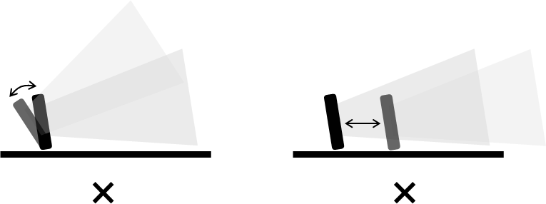

## 7.3	올바른 외장형 레이더 센서 사용
외장형 레이더 센서는 반드시 위치가 고정된 상태로 사용해야 한다. 센서가 흔들리거나 임의로 위치가 변경되면 센서의 오탐지 또는 미탐지가 발생할 수 있으며, 특히 안전 기능이 정상적으로 동작하지 않을 수 있다.

     </img>

센서의 전방 감지 영역 내에 객체 감지를 방해할 수 있는 장애물 또는 움직이는 물체가 없어야 한다. 센서 전방에 설치된 장애물을 통해 오탐지 또는 미탐지의 가능성이 있어 주의를 필요로 한다.

     </img>

센서가 설치된 바닥의 재질에 따라 센서의 오탐지 또는 미탐지가 발생할 수 있다. 바닥에 의한 감지 오류가 우려되는 환경에서는 센서를 바닥에서 일정 거리 이상 띄워서 설치하거나 센서 각도를 변경함으로써, 센서가 바닥을 감지하지 않도록 주의한다.

     </img>

