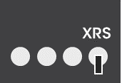
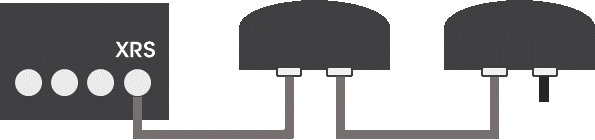

### 7.4.1	설치 방법
- 외장형 레이더 센서 미 설치 시(내장형 레이더만 사용하는 경우)
로봇 베이스 후면의 XRS 커넥터에 종단 저항을 연결한다.

     </img>

- 외장형 레이더 1대 설치 시 연결 방법  
로봇 베이스 후면의 XRS 커넥터와 외장형 레이더 후면에 위치한 커넥터 중 하나를 케이블로 연결한다. 외장형 레이더의 남은 커넥터에는 종단 저항을 결합한다.

     </img>

- 외장형 레이더 2대 설치 시 연결 방법  
로봇 베이스 후면의 XRS 커넥터와 첫 번째 외장형 레이더 후면에 위치한 커넥터 중 하나를 케이블로 연결한다. 첫 번째 외장형 레이더의 남은 커넥터는 두 번째 외장형 레이더와 케이블로 연결한다. 최종적으로 비어있는 두 번째 외장형 레이더의 커넥터에 종단 저항을 결합한다. 즉, 케이블 배선상 가장 원거리에 위치한 외장형 레이더에 종단 저항을 결합한다.

     </img>

