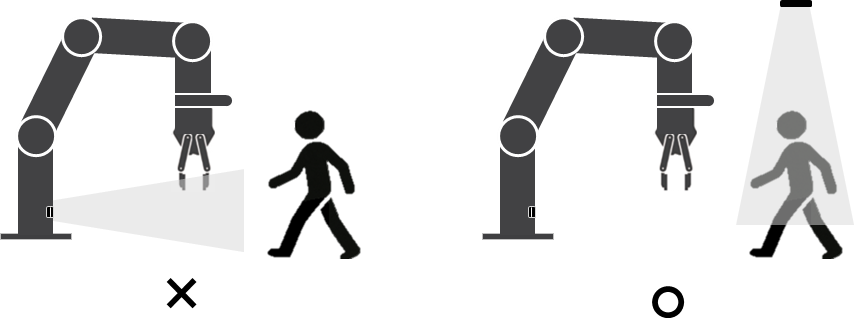

### 7.4.2	Outside of the robot ‘s operating range
Since false detections may occur if the robot obstructs or passes in front of the built-in radar sensor, the robot’s operating range must be excluded from the detection zone. However, this configuration creates a limitation where objects approaching the robot from outside the robot working area cannot be detected. To compensate for this limitation of the built-in sensor, an additional external radar sensor can be installed, and its detection zone should be configured to cover the area outside the robot’s operating range.

     </img>

