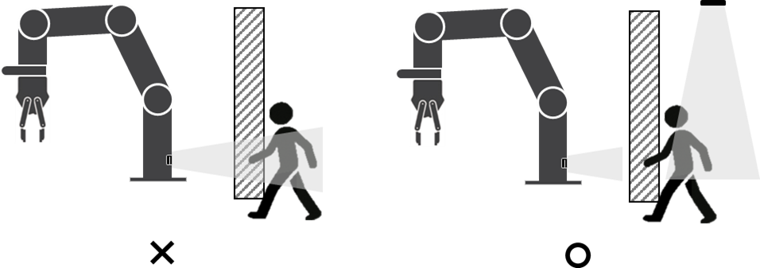

### 7.4.3	Around obstacles
To prevent degradation of sensor detection performance, surrounding obstacles such as fences, pillars, and walls must be excluded from the detection zone. This may result in a reduced detection zone; if the detection zone needs to be expanded further to ensure safety, an external radar sensor can be installed to compensate. 

     </img>

