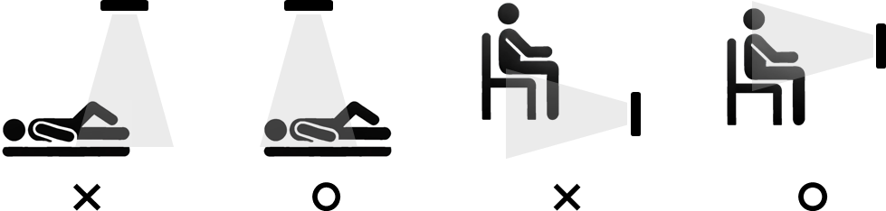
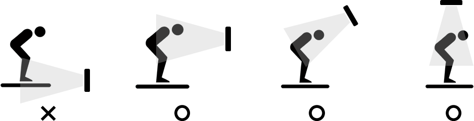
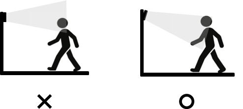

## 7.5	Examples of proper sensor placement for safety function operation
The figure below illustrates examples of normal operation and malfunction of the safety function depending on the detected part of the object. Since sensor performance is influenced by the installation position and environment, sensors must be placed to suit the specific working environment by referring to the examples below. You must thoroughly review the surface area of the target object and the sensor's detection range to ensure that a sufficient detected surface area of the object is secured.

     </img>

     </img>

     </img>

