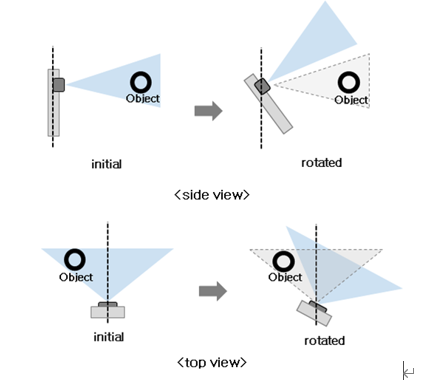
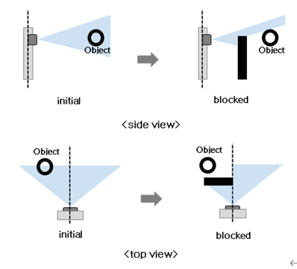

# Object Detection System
## 7.1	부가 기능 개요

시스템은 아래와 같은 부가 기능을 수행한다.

### 7.1.1	축 주위 회전 방지 : 센서 설치 상태의 축 상태를 저장하여 축 주위 회전이 발생 했을 시 시스템이 경고를 발생한다.

센서를 로봇 외부에 설치 시 센서 축의 위치정보는 센서에서 센서 컨트롤 보드로 상시 전달하며 컨트롤 보드는 축의 각도 정보를 실시간으로 모니터링 하여 축 회전이 발생 하였는지 판단 후 축 회전이 발생 하였을 시 시스템이 경고를 발생한다.

축 주위 회전 방지 기능은 각 센서 개별로 On/Off로 설정 할 수 있으며 외부 장착 레이다 사용시 On으로 설정하여야 한다. 

축 주위 회전 방지 기능은 반드시 고정된 상태에서 사용하여야 한다.

### 7.1.2	센서 전방 가림 탐지 : 센서 전방 탐색 중 정적 물체에 의한 가려짐 현상이 일정시간 이상 발생 시 시스템이 경고를 발생 한다.

센서는 시야를 방해할 수 있는 환경 변화를 감지하면, 컨트롤러로 신호를 보낸다. 센서는 관측 각도 범위 설정에 관계 없이 수평면에서 -50°~50°까지의 각도 범위를 감시한다. 

센서 전방의 장애물로 인한 가람 탐지는 센서에서 수행하며 탐지 결과를 센서 컨트롤보드로 전송한다. 센서 전방 가림 탐지가 일정 시간 지속 되면 시스템이 경고를 발생한다..

센서 전방 가림 탐지 기능은 로봇이 멈춘 상태에서 전방 가림 탐지 후 가림 탐지 시 로봇은 멈춤 상태로 유지 된다.. 

센서 전방 가림 탐지로 로봇이 멈춘 경우 전방 장애물을 제거한 후 컨트롤 보드에 리셋시그널을 보내고 재시동 한다.

