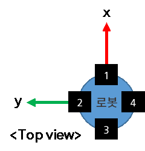

### 8.1.1	Detection area configuration
Go to [system] – [10. Safety System] – [Safety Radar] - [radar sensor setting] menu to configure the detection zone. 
-	Tabs 1 to 6: Up to six radar sensors can be used. Tabs 1 to 4 represent the built-in radars installed on the robot base, while Tabs 5 and 6 represent the external radars. The installation locations of the built-in radars are shown in the figure below.

     </img>

-	Active: Enables or disables the radar sensor
-	zone1: When the built-in radar sensor is enabled, Zone 1 (the stop zone) is automatically enabled. The value entered for zone1 is its start point, and its end point is equal to the start point of the next enabled zone. For example, if the start point of Zone 1 is set to 500, Zone 2 is disabled, and Zone 3 is enabled with a start point of 2000, the range for Zone 1 will be 500 to 2000 mm.
-	zone2 ~ 4: Enter the start point for each zone; the start point of the next enabled zone serves as the end point of the previous zone. For example, if zone2 is set to 1000 and zone3 is set to 2000 and enabled, the range for zone2 is configured from 1000 to 2000 mm. When a moving object is detected within zones 2 to 4, a robot deceleration signal is output. The input range is 1000 to 5000. 
-	End point: Sets the end point of the last zone. The input range is 500 to 5000.
-	Valid azimuth start/end: Sets the start and end of angles of the detection zone. The input range is -55° to 55°.
