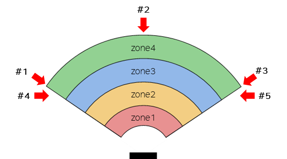

#### 8.1.6.2	재시동 방지 기능 검증 절차
시스템을 테스트 조건에 따라 작동 시켰을 때 재시동 방지 기능이 작동해야 하며, 작동 환경에 재시동 방지 기능의 성능을 저하시키는 요소가 없어야 한다. 재시동 방지 기능을 검증할 때 적용되는 요구사항은 다음과 같다. 
-	접근 감지 기능으로 인해 로봇이 정지 또는 감속한 상태이어야 한다.
-	검증 참여자는 사전에 설정된 정지 영역과 경고 영역이 실제 공간의 어느 지점에 해당하는지 정확히 인지하고 있어야 한다.

재시동 방지 기능 검증은 감지 대상의 안전을 확보하고 정확한 기능의 검증을 위하여 아래의 조건에서 시작해야 한다.
-	접근 감지 기능이 활성화된 상태
    -   레이더 센서 설정 – 센서별 활성화
    -   레이더 replan – Replan 활성화, 속도 비율 100 미만 입력
    -   레이더 물체 감지 파라미터 – 각 파라미터 입력
-	시스템이 정상적으로 연결된 상태
    -   레이더 버전 정보 – CAN 상태 정상
-	안전한 작업을 위해 최소 2인 1조로 검증을 진행해야 한다. 작업자 중 한 명은 감지 대상 역할을 수행하고, 다른 한 명은 감지하지 못해 발생할 수 있는 비상 상황에 즉각 대응할 수 있도록 대기해야 한다. 감지 대상자는 반드시 로봇의 작업 영역 외부에 있어야 한다.

일반적인 상황에서 재시동 방지 기능을 검증하기 위해 수행하는 테스트 절차는 아래와 같다. 만약 아래의 조건만으로 확인하기 어려운 환경적 특수성이 존재한다면, 이를 반영하여 필수 테스트 항목을 추가로 정의하고 해당 테스트 조건 및 결과를 상세히 기록해야 한다.

     </img>

-	접근 지점 #1부터 #5는 감지 대상자의 진입 위치 및 접근 방향을 나타낸다. 세부적인 진입 위치는 아래와 같으며, 접근 방향은 표시된 화살표 방향을 따른다. 만약 명시된 항목 외에도 작업자의 동선, 로봇 운용 중 발생하는 장애물, 또는 현장의 환경적 특수성으로 인해 추가적인 검증이 필요한 지점이 있다면 이를 반드시 포함하여 테스트해야 한다.
    -   #1: 영역 종료 지점 & 각도 시작 위치
    -   #2: 영역 종료 지점 & 각도 중간 위치
    -   #3: 영역 종료 지점 & 각도 종료 위치
    -   #4: 영역 중간 지점 & 각도 시작 위치
    -   #5: 영역 중간 지점 & 각도 종료 위치

-	테스트 순서는 다음과 같다.
1.	전원을 공급하여 시스템을 작동시킨다.
2.	접근 감지 기능을 활성화한 후 시스템이 정상적으로 연결되었는지 확인한다.
3.	레이더 센서 전방을 가리지 않는 모션으로 로봇을 동작시킨다.
4.	접근 지점 #1로 감지 대상자가 감지 영역에 진입한다.
5.	영역 종류에 따른 로봇 정지 또는 감속이 되는지 확인한다.
6.	로봇 상태가 유지되는지 확인한다.
7.	감지 대상자가 모든 감지 영역 외부로 이동한다.
8.	재시동 신호를 인가한 후 로봇이 정상 동작하는지 확인한다.
9.	모든 접근 지점에 대하여 3 ~ 8 단계를 반복한다.
