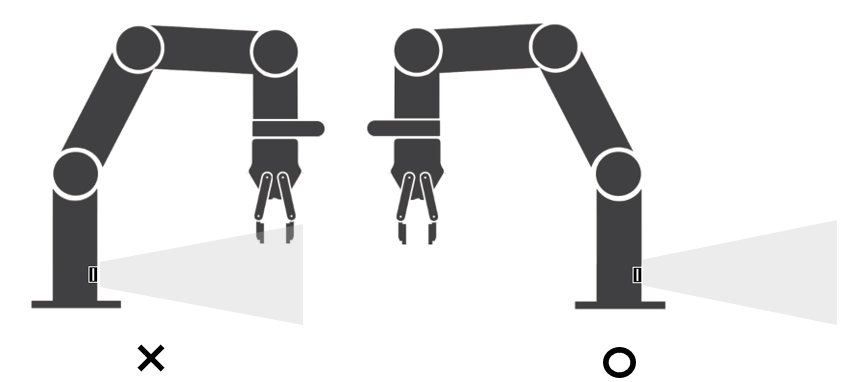
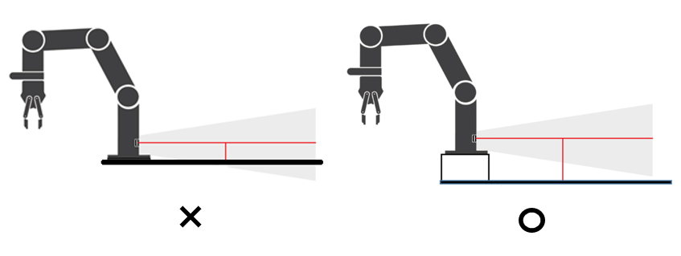
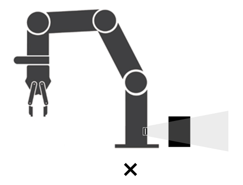
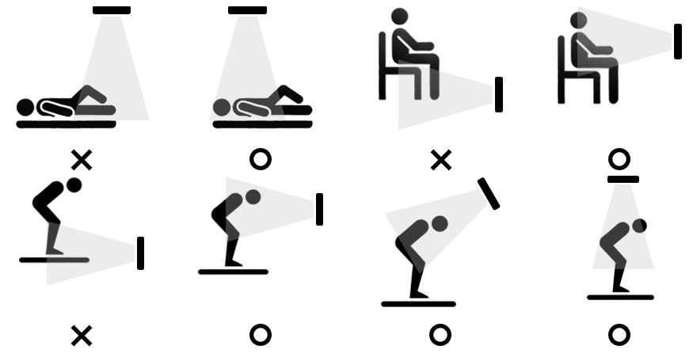

# Object Detection System

## 8.1 Sensor Position Guidelines to Prevent Malfunction of Safety Functions

The safety functions operate when the sensor can detect human movement (including static residual movement). The safety functions are guaranteed to operate correctly only when the person’s chest is included within the sensor’s detection range. Therefore, detection is not guaranteed in cases where the person is crouching, lying down, etc.【211†source】

### 8.1.1 Situations Requiring Caution
Caution is required in environments where the system operates as follows, and additional safety measures may be necessary:
* When there are objects that may obstruct detection in the sensor’s detection area, or there is a possibility of such objects.  
* When people may work while lying down or sitting within the sensor’s detection area.  
* When, due to the robot’s installation position, a person’s upper body is not detected in the detection area as they approach the robot.  
* When objects may approach the robot’s arm movement area faster than detectable speed.  
* When objects may move away from the robot in a direction not detectable by the sensor.  

### 8.1.2 Sensor Installation to Ensure Safety Function Operation (Robot Base Sensor Installation)
When using sensors mounted on the robot base, the robot’s movement may obstruct the front of the sensor, which can cause false detection or missed detection, requiring caution. 

The sensor installed on the robot base must be positioned so that it does not detect the floor. If installed lower, false or missed detections may occur due to floor material or steps, requiring caution.

There must be no obstacles or moving objects in the sensor’s front detection area that could obstruct detection. Obstacles installed in front of the sensor may cause false or missed detections, requiring caution.

### 8.1.3 Sensor Installation to Ensure Safety Function Operation (External Sensor Installation)
The following diagram shows examples of sensor placements (X = incorrect, O = correct) that may cause system malfunction or ensure proper safety function operation. This is only part of the overall installation method and should be referenced to establish a proper working environment.

