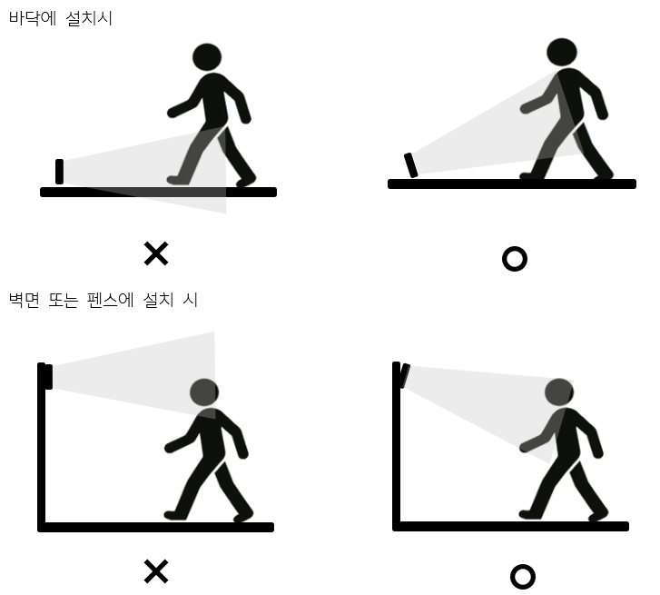

# Object Detection System

## 8.2 General Sensor Position Guidelines

### 8.2.1 Factors Determining Sensor Field of View
The detection area that the system can observe is determined by the sensor’s installation height, configured angle, and distance. If there are obstacles within the detection area, measurement accuracy cannot be guaranteed in obstructed regions.

### 8.2.2 Sensor Measurement Area and Range
The system’s measurable area is divided into the robot’s working area, stop area, and warning area.
* **Robot working area**: The area where the robot arm operates, centered on the robot base. Movements detected in this area are ignored.  
* **Stop area**: The area between the robot’s working area and the warning area. Generally circular around the robot base. If movement is detected here, the robot stops immediately.  
* **Warning area**: The area from the end of the stop area to the configured end point. Generally circular around the robot base. If movement is detected here, the robot decelerates (or stops depending on user settings).  

### 8.2.3 Position Recommendations

#### 8.2.3.1 Common Considerations
To ensure measurement accuracy, the following recommendations apply:
* If the correctly installed sensor is at a height of **≤1400 mm** from the ground, adjust the angle or measurement distance so the floor is not detected.  
* If the correctly installed sensor is at a height of **≥TBD mm** from the ground, additional safety measures are required to prevent undetected human access.  
* When used outdoors, the system must be protected from rain, snow, etc. Operation outside specifications will compromise system longevity.  

#### 8.2.3.2 External Sensor  
For **approach detection**:
1. If the distance between the ground and the lower part of the field of view exceeds 20 cm, preventive measures must be taken to detect people entering hazardous areas under the field of view.  
2. If the distance from the ground is less than 20 cm, the upward tilt angle must be at least 10°.  
3. Installation height (from ground to sensor center) must be 15 cm.  

For **access‑control purposes**:
1. Installation height (from ground to sensor center) must be 20 cm.  
2. Observation angle range must be 90°.  
3. Tilt angle must be +40°.  
4. Rotation range relative to the z‑axis must be 90°.  
