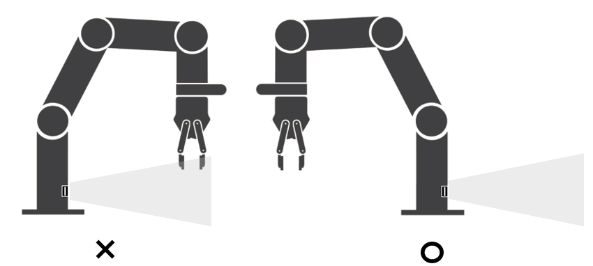
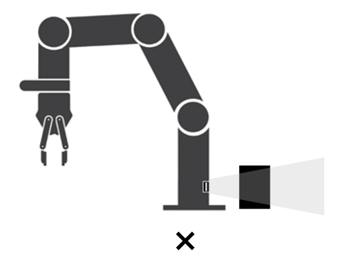
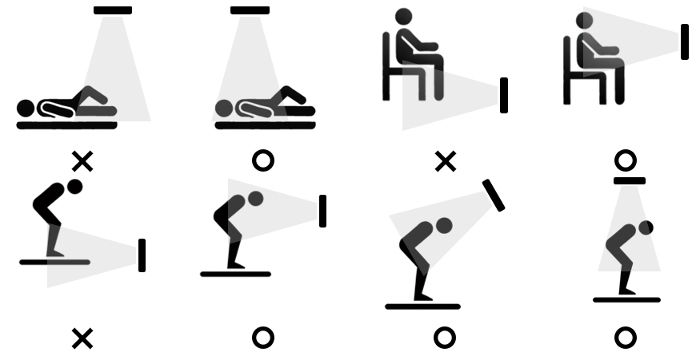

# Object Detection System
## 8.1	안전 기능의 오작동 방지를 위한 센서 위치 지침

 안전 기능은 센서가 사람의 움직임(정적 잔류 움직임 포함)을 감지할 수 있을 때 작동한다. 안전 기능은 센서의 감지 범위 내 사람의 가슴이 포함되어 있는 경우에만 올바른 작동을 보장한다. 따라서 대상이 쪼그려 앉거나 누워 있는 등의 경우에는 감지를 보장하지 않는다.

### 8.1.1	주의가 필요한 상황

 해당 시스템이 작동하는 환경이 아래와 같은 경우 주의가 필요하며 경우에 따라 추가적인 안전 조치를 수행해야 한다. 
* 센서의 감지 영역 내 감지를 방해할 수 있는 물체가 있거나, 가능성이 있음
* 센서의 감지 영역 내에서 사람이 눕거나 앉아서 작업을 수행하는 경우가 있음
* 로봇 설치 위치 등의 문제로 사람이 로봇으로 접근할 때 감지 영역 내 사람의 상반신이 감지되지 않음
* 로봇의 팔이 움직이는 영역에 감지 가능한 속도보다 빠르게 객체가 접근할 가능성이 있음
* 로봇에서 시작하여 멀어지는 방향으로 객체가 움직일 가능성이 있음

### 8.1.2	안전 기능의 작동을 보장하는 센서 설치(로봇 베이스 센서 설치)

로봇 베이스에 장착된 센서의 사용시 로봇의 동작이 센서의 전면 부를 가리는 경우 센서의 오탐지 및 미탐지 가능성이 있어 사용시 주의를 필요로 한다. 

로봇 베이스에 장착된 센서의 높이가 바닥을 감지 하지 않도록 설치가 되어야 하며 이보다 센서위치가 낮게 설치될 시 바닥 재질 및 바닥 턱등에 의한 오탐지 및 미탐지 가능성이 있어 주의를 필요로 한다.                         

센서의 전방 탐지영역내에 센서의 탐지를 방해 할 수 있는 장애물 또는 움직이는 물체가 없어야 한다. 센서 전방에 설치된 장애물을 통해 오탐지 및 미탐지의 가능성이 있어 주의를 필요로 한다. 

### 8.1.3	안전 기능의 작동을 보장하는 센서 설치(로봇 외부 센서 설치)

아래의 그림은 시스템의 오작동을 야기할 수 있는 센서의 배치(X)와 안전 기능의 올바른 작동을 위한 센서의 배치(O) 대한 예시이다. 이는 전체 설치 방식의 일부이며 이를 참고하여 적절한 배치를 가질 수 있도록 작업 환경을 구축해야 한다.

