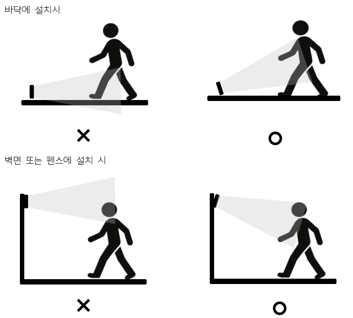

# Object Detection System
## 8.2	일반적인 센서 위치 지침

### 8.2.1	센서 시야의 결정 요소

 시스템이 관측할 수 있는 감지 영역은 센서의 설치 높이와 설정된 각도, 거리와 함께 결정된다. 감지 영역 내 장애물 등이 위치하는 경우 이에 의해 가려진 영역에 대해서는 측정 정확도를 보장할 수 없다.

### 8.2.2	센서 측정 영역 및 범위

 시스템이 측정할 수 있는 영역은 로봇의 작업 영역, 정지 영역, 그리고 경고 영역으로 구분한다.

* 로봇의 작업 영역: 로봇 베이스를 중심으로 로봇 팔이 작동하는 영역. 해당 영역에서 감지된 움직임은 무시한다.
* 정지 영역: 로봇의 작업 영역과 경고 영역 사이의 영역. 일반적으로 로봇의 베이스를 기준으로 원형의 형태를 가지며, 해당 영역에서 움직임이 감지되는 경우 로봇이 즉시 정지한다.
* 경고 영역: 경고 영역의 종료지점부터 설정한 종료 지점까지의 영역. 로봇의 베이스를 기준으로 원형의 형태를 가지며, 해당 영역에서 움직임이 감지되는 경우 로봇을 감속한다. (사용자의 설정에 따라 정지 시킬 수도 있다.)

### 8.2.3	위치 권장 사항

### 8.2.3.1	공통 사항
 시스템의 측정 정확도를 보장하기 위하여 아래와 같은 위치 권장 사항을 가진다.
* 올바른 위치에 부착된 센서의 위치가 지면에서 1400mm 이하인 경우 바닥을 감지하지 않도록 각도 혹은 측정 거리를 조절해야 한다.
* 올바른 위치에 부착된 센서의 위치가 지면에서 TBDmm 이상인 경우 감지되지 되지 않는 영역으로 사람이 접근하지 않도록 추가적인 안전 조치를 수행해야 한다.
* 시스템을 야외에서 사용하는 경우 강우, 눈 등으로부터 보호해야하며, 사양을 벗어난 조건으로 구동 시 시스템 수명을 보장할 수 없다.

### 8.2.3.2	외장형 센서 
접근 감지 기능인 경우
다음은 접근 감지 기능과 관련하여 센서 위치 지정에 대한 몇 가지 권장 사항이다.
1.	지면과 시야의 바닥 부분 사이의 거리가 20 cm보다 길 경우 시야로 모니터링되는 볼륨 아래를 통해 위험 영역으로 들어가는 사람도 감지하도록 예방 조치를 취해야 한다.
2.	지면으로부터의 거리가 20 cm 미만일 경우 상향 기울기 각도가 최소 10°는 되도록 센서를 설치한다.
3.	설치 높이(지면에서 센서 중심까지)는 15cm.

출입 통제 용도인 경우                   
다음은 출입 통제를 위해 설치된 경우 센서 위치 지정에 대한 몇 가지 권장 사항이다.
1.	설치 높이(지면에서 센서 중심까지)는 20cm.
2.	관측 각도 범위는 90°여야 한다.
3.	기울기 각도는 +40°여야 한다.
4.	z축 기준 회전 범위는 90°여야 한다.

