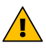

# Object Detection System

## 9.3	구성 변경

 
시스템의 구성을 변경하는 동안에는 시스템이 의도한 대로 작동하는 것을 보장할 수 없으므로 위험이 발생 가능성이 있는 영역에 대한 안전 조치가 요구된다. 시스템의 구성을 임의로 변경하는 경우 감지 영역에 변동이 생기므로 초기 설정한 전체 감지 영역에 대해 시스템이 작동하는 것을 보장할 수 없다.

9.3.1	감지 영역 설정 변경

1.	화면 하단의 [시스템] 진입
2.	[Safety Radar] – [Detection information] 순서대로 진입
3.	상단 탭에서 변경하고자 하는 감지 영역의 ID 값을 선택
4.	희망 값을 수정
5.	[save] – 비밀번호 입력 순서대로 진행하여 설정 값을 저장

9.3.2	센서 설정 변경

1.	화면 하단의 [시스템] 진입
2.	[Safety Radar] – [Radar Sensor Information] 순서대로 진입
3.	상단 탭에서 변경하고자 하는 센서 유닛의 ID 값을 선택
4.	희망 값을 수정
5.	[save] – 비밀번호 순서대로 진행하여 설정 값을 저장
