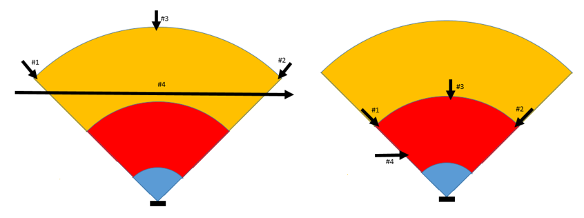

# Object Detection System

## 9	구성 및 사용

## 9.1	구성 절차

 
시스템의 초기 구성은 승인된 사람만 수행해야 한다. 시스템을 구성하기 전 해당 시스템을 통해 제어되는 로봇이 의도한대로 작동하는지 확인해야 한다.

### 9.1.1	시스템 연결 확인

 시스템이 정상적으로 작동하기 위해서는 로봇 제어기와 시스템이 올바르게 연결되어야 한다. 시스템이 올바르게 연결되어 있는지는 TP를 사용하여 확인한다. 시스템 연결을 확인 방법은 아래와 같다.

1.	[시스템] – [Safety Radar] – [Monitoring] 순서대로 진입
2.	제어 유닛 및 센서 유닛이 모두 연결되어 있는지 확인
(센서의 경우 설치 개수와 동일하게 연결되어 있는지 확인 필요)

### 9.1.2	감지 영역 설정

 로봇의 팔을 로봇으로 접근하는 객체로 감지하는 것을 방지하기 위하여 로봇의 활동 영역을 설정한다. 시스템이 작동하는 환경과 기능 안전 표준에 따라 정지 영역과 경고 영역을 설정한다. 이를 설정하는 방법은 아래와 같다. 

1.	[시스템] – [Safety Radar] – [Detection information] 순서대로 진입
2.	측정 시작 지점을 로봇의 활동 영역 종료 지점으로 설정
3.	측정 종료 지점을 경고 영역의 종료 지점으로 설정 (최대 5000mm)
4.	경고 영역 시작 지점을 설정
5.	[save] 버튼을 누른 후 비밀번호를 입력하여 설정 값 저장
 측정 시작 지점부터 경고 영역 시작 지점까지 정지 영역으로 설정되며, 경고 영역 시작 지점부터 측정 종료 지점까지 경고 영역으로 설정된다.

### 9.1.3	안전 기능 검증

시스템은 다양한 환경에서 작동할 수 있으므로 설치자는 시스템의 설치 및 초기 설정 후 감지 영역이 적절하게 설정되고 안전 기능이 의도대로 작동하는 지 검증해야 한다. 
 
검증이 완료되지 않은 상태의 시스템은 안전 기능의 작동을 보장하지 않는다. 아래의 검증 내용에 언급되어 있지 않더라도 시스템이 작동하는 환경의 특수성이 존재하는 경우 이를 검증 내용에 추가하여 필수 테스트를 정의해야 한다. 모든 검증 내용은 추후 증빙을 위한 자료로 기록한다.

### 9.1.3.1	접근 감지 기능 검증 절차

 시스템을 테스트 조건에 따라 작동 시켰을 때 접근 감지 안전 기능이 작동해야 하며, 작동 환경에 접근 감지 기능의 성능을 저하시키는 요소가 없어야 한다. 접근 감지 기능을 검증할 때 적용되는 요구사항은 다음과 같다.

* 검증 시 감지 대상이 되는 사람은 감지 가능한 최대/최소 속도 내에서 움직여야 한다.
* 검증 시 감지 대상이 되는 사람을 물체가 가리지 않아야 한다.
* 검증 시 감지 대상이 되는 사람은 정상 호흡을 해야 한다.
* 검증 참여자는 설정된 정지 영역과 경고 영역이 공간 내 어느 지점인지 인지하고 있어야 한다.

접근 감지 기능 검증은 감지 대상이 되는 사람의 안전을 확보하고 정확한 기능의 검증을 위하여 아래의 조건에서 시작해야 한다.

* 접근 감지 기능이 활성화된 상태
* 시스템이 정상적으로 연결된 상태
* 로봇의 전원이 꺼진 상태

일반적인 상황에서 접근 감지 기능을 검증하기 위한 감지 대상은 아래의 조건을 만족해야 한다.

* 객체 유형: 사람(감지 영역 내 사람의 상반신이 포함되어야 함)
* 이동 속도: 1.6m/s (일반적인 성인의 평균 이동 속도)

일반적인 상황에서 접근 감지 기능을 검증하기 위해 수행하는 테스트 절차는 아래와 같다. 만약 아래의 조건에서 확인할 수 없는 환경적 특수성이 있는 경우 이를 반영하여 필수 테스트를 추가적으로 정의해야 하고 테스트 조건에 대해 기록해야 한다.

1.	로봇의 작동 환경에서 아래의 조건 중 하나 이상을 만족하며 작업자가 접근 가능한 위치를 확인하고 접근 지점으로 지정한다.
A.	정지 영역 종료 지점과 경고 영역 시작 지점의 경계 
B.	경고 영역의 종료 지점
C.	작업자 혹은 로봇의 작동에 따라 생성되는 부분적으로 장애물이 존재하는 지점
D.	환경적 특수성을 반영하여 검증 수행자가 지정한 위치
2.	로봇에 전원을 공급하여 시스템을 작동시킨다.
3.	감지 대상이 감지 영역 밖에서 1에서 지정한 접근 지점 중 하나로 이동하며 접근 감지 기능이 작동하는지 확인한다.
4.	테스트 허용 기준을 만족하는 지 확인한다. 만족하지 않는 경우 문제 해결 방안에 따라 문제를 해결한다.
5.	모든 지정된 접근 지점에 대하여 2-4 단계를 반복한다.

 모든 접근 지점에 대하여 시스템은 아래와 같이 작동해야 한다.

* 접근 지점이 경고 영역 내 있는 경우 대상이 경고 영역에 진입하는 시점에 로봇은 감속하여 접근 지점에 도달하였을 때도 감속한 상태를 유지한다.
* 접근 지점이 정지 영역 내 있는 경우 대상이 경고 영역에 진입하는 시점에 로봇은 감속하며 정지 영역에 진입하는 순간 로봇이 정지한다. 접근 지점에 도달하였을 때도 로봇은 정지 상태를 유지한다.

### 9.1.3.2	재시동 방지 기능 검증 절차

시스템을 테스트 조건에 따라 작동 시켰을 때 재시동 방지 기능이 작동해야 하며, 작동 환경에 재시동 방지 기능의 성능을 저하시키는 요소가 없어야 한다. 재시동 방지 기능을 검증할 때 적용되는 요구사항은 다음과 같다. 

* 검증 시 감지 대상이 되는 사람은 감지 가능한 최대/최소 속도 내에서 움직여야 한다.
* 검증 시 감지 대상이 되는 사람을 물체가 가리지 않아야 한다.
* 검증 시 감지 대상이 되는 사람은 정상 호흡을 해야 한다.
* 검증 참여자는 설정된 정지 영역과 경고 영역이 공간 내 어느 지점인지 인지하고 있어야 한다.

재시동 방지 기능 검증은 감지 대상이 되는 사람의 안전을 확보하고 정확한 기능의 검증을 위하여 아래의 조건에서 시작해야 한다.

* 접근 방지 기능 및 재시동 방지 기능이 활성화된 상태
* 시스템이 정상적으로 연결된 상태
* 로봇의 전원이 꺼진 상태

일반적인 상황에서 재시동 방지 기능을 검증하기 위하여 감지 대상은 아래의 조건을 만족해야 한다.

* 객체 유형: 사람(감지 영역 내 사람의 상반신이 포함되어야 함)
* 이동 속도: 0m/s (정적 잔류 움직임만을 가진 상태)
* 자세: 서있는 자세
* 자세 유지 시간: 4초 이상

일반적인 상황에서 재시동 방지 기능을 검증하기 위해 수행하는 테스트 절차는 아래와 같다. 만약 아래의 조건에서 확인할 수 없는 환경적 특수성이 있는 경우 이를 반영하여 필수 테스트를 추가적으로 정의하고 테스트 조건에 대해 기록해야 한다.

1.	로봇의 작동 환경에서 아래의 조건 중 하나 이상을 만족하며 작업자가 접근 가능한 위치를 확인하고 접근 지점으로 지정한다.
A.	정지 영역 종료 지점과 경고 영역 시작 지점의 경계
B.	경고 영역의 종료 지점
C.	작업자 혹은 로봇의 작동에 따라 생성되는 부분적으로 장애물이 존재하는 지점
D.	환경적 특수성을 반영하여 검증 수행자가 지정한 위치
2.	로봇에 전원을 공급하여 시스템을 작동시킨다.
3.	감지 대상이 감지 영역 밖에서 1에 지정한 접근 지점 중 하나로 이동하며 접근 지점에 도달 후 해당 위치에서 정지한다.
4.	4초 이상 서 있는 자세 혹은 웅크린 자세를 유지하며 로봇이 정지 상태를 유지하는 지 확인한다.
5.	감지 대상이 해당 영역에서 감지 영역 밖으로 완전히 벗어나 로봇이 다시 작동하는 지 확인한다.
6.	테스트 허용 기준을 만족하는 지 확인한다. 만족하지 않는 경우 문제 해결 방안에 따라 문제를 해결한다.
7.	모든 지정된 접근 지점에 대하여 2-6 단계를 반복한다.

모든 접근 지점에 대하여 시스템은 아래와 같이 작동해야 한다.

* 접근 지점이 정지 영역 내 있는 경우 대상이 정지 영역에 진입하는 지점에서 로봇은 정지하며 대상이 정지 영역에서 벗어나기 전까지 정지 상태를 유지한다.
* 대상이 감지 영역에서 완전히 벗어날 때 로봇은 다시 작동한다.

9.1.4	부가 기능 검증
시스템은 다양한 환경에서 작동할 수 있으므로 설치자는 시스템의 설치 및 초기 설정 후 부가 기능이 의도대로 작동하는 지 검증해야 한다. 
 
검증이 완료되지 않은 상태의 시스템은 부가 기능의 작동을 보장하지 않는다. 아래의 검증 내용에 언급되어 있지 않더라도 시스템이 작동하는 환경의 특수성이 존재하는 경우 이를 검증 내용에 추가하여 필수 테스트를 정의해야 한다. 모든 검증 내용은 추후 증빙을 위한 자료로 기록한다.

### 9.1.4.1	축 주위 회전 방지 기능 검증 절차

 시스템을 테스트 조건에 따라 작동 시켰을 때 축 주위 회전 방지 기능이 작동해야 하며, 작동 환경에 축 주위 회전 방지 감지 기능의 성능을 저하시키는 요소가 없어야 한다. 축 주위 회전 방지 기능을 검증할 때 적용되는 요구사항은 다음과 같다.

* 축 주위 회전 방지 기능은 센서를 외부에 장착 시 검증 한다.
* 외부에 센서 설치 시 센서가 반드시 고정된 상태에서 검증 한다.

축 주위 회전 방지 기능의 검증 방법은 아래와 같다. 만약 아래의 조건에서 확인할 수 없는 환경적 특수성이 있는 경우 이를 반영하여 필수 테스트를 추가적으로 정의해야 하고 테스트 조건에 대해 기록해야 한다.

1.	외부 센서 장착 위치에 센서를 설치(센서 위치 고정) 한다.
2.	로봇의 전원을 공급하여 시스템을 동작시킨다.
3.	TP의 센서 설정 메뉴에서 축 주위 회전 방지 기능을 On 시킨다.
4.	축 주의 회전 방지 기능이 On인 상태에서 축 주위 회전 방지 경고가 발생하는지 확인한다.
5.	센서의 축을 X 방향으로 정해진 범위 이상 회전 시킨다.
6.	센서의 축을 Y 방향으로 정해진 범위 이상 회전 시킨다.
7.	센서의 축을 Z 방향으로 정해진 범위 이상 회전 시킨다.
8.	5~7번을 수행하여 경고가 발생하는지 확인 한다.

  축 주위 회전 방지 기능에 대하여 시스템은 아래와 같이 작동해야 한다.

* 센서 외부 장착 후 센서 고정 시 센서의 X,Y,Z값의 편차가 정해진 범위 내에 들어와야 한다.
* 센서의 각 축이 정해진 범위 이상 벗어나면 시스템은 축 주위 회전 경고를 발생 시켜야 한다.
* 축 주위 회전 경고가 발생하면 시스템은 안전 상태로 진입한다.

9.1.4.2	센서 전방 가림 탐지 기능 검증 절차

시스템을 테스트 조건에 따라 작동 시켰을 때 센서 전방 가림 탐지 기능이 작동해야 하며, 작동 환경에 센서 전방 가림 탐지 기능의 성능을 저하시키는 요소가 없어야 한다. 센서 전방 가림 탐지 기능을 검증할 때 적용되는 요구사항은 다음과 같다.

* 로봇이 멈춤 상태에서 재시동 시 센서 전방 탐지 기능이 작동한다.

축 주위 회전 방지 기능의 검증 방법은 아래와 같다. 만약 아래의 조건에서 확인할 수 없는 환경적 특수성이 있는 경우 이를 반영하여 필수 테스트를 추가적으로 정의해야 하고 테스트 조건에 대해 기록해야 한다.

1.	로봇의 전원을 공급하여 시스템을 동작시킨다.
2.	센서 전방 가림 탐지 기능 On 상태로 설정 한다.
3.	센서 전방 TBDmm이내에 장애물을 배치하고 로봇을 동작 시킨다.
4.	로봇 동작 시작 후 4초 이내에 장애물을 탐지하고 경고를 발생하는지 확인한다.
5.	경고 발생후 로봇은 안전 상태로 진입한다.

센서 전방 가림 탐지 기능에 대하여 시스템은 아래와 같이 작동해야 한다.

* 로봇이 정지 상태에서 재시동 시 센서 전방에 장애물이 탐지 되면 전방 가람 탐지 경고를 발생시키고, 시스템이 로봇을 안전 상태로 진입 시킨다.
