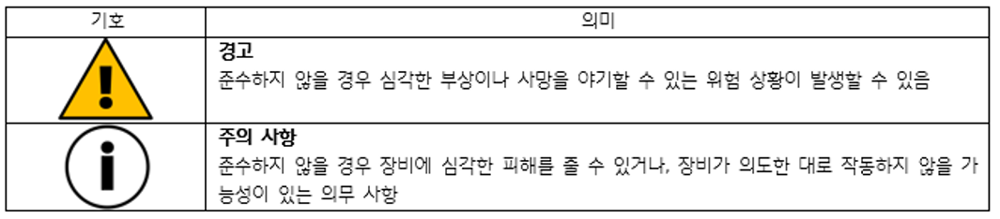

# Object Detection System

1	개요

1.1	문서의 목적
본 문서는 협동 로봇 HDC35-18에 탑재되는 서브 시스템인 객체 감지 시스템에 대한 설명을 목적으로 한다. 본 문서는 시스템을 제어/사용하는 사람을 보호하는 방법과 안전한 설치, 사용, 유지관리 방법에 대한 설명을 포함한다.
본 문서에는 IEC 61508에 따른 안전 관련 정보가 포함되어 있다. 모든 안전과 관련된 요소는 협동 로봇 HDC35-18의 서브 시스템으로 작동하는 것을 전제로 하며, 객체 감지 시스템만 별도 구동 시 안전을 보장할 수 없다. 
본 문서는 협동 로봇 HDC35-18과 로봇의 안전 관련 메인 제어 시스템, 주변 기기에 대한 설명을 취급하지 않는다.

1.2	관련 의무
본 문서는 제품의 주요 구성요소로 제품의 실용 수명이 끝날 때까지 보관해야 한다. 납품 시점부터 폐기 시점까지 객체 감지 시스템과 관련된 모든 상황에서 본 설명서를 참조해야 한다. 또한 시스템을 사용하는 사람이 접근하기 쉽고 파손될 위험이 없는 곳에서 파손없이 보관해야 한다. 만약 설명서를 분실하거나 손상된 경우 판매처에 연락해야 한다.

1.3	대상 사용자
* 제조사: 시스템을 개발한 업체
* 설치자: 시스템 설치, 구성 담당자
* 유지보수 담당자: 시스템 유지보수 담당자

1.4	기호 및 의미

